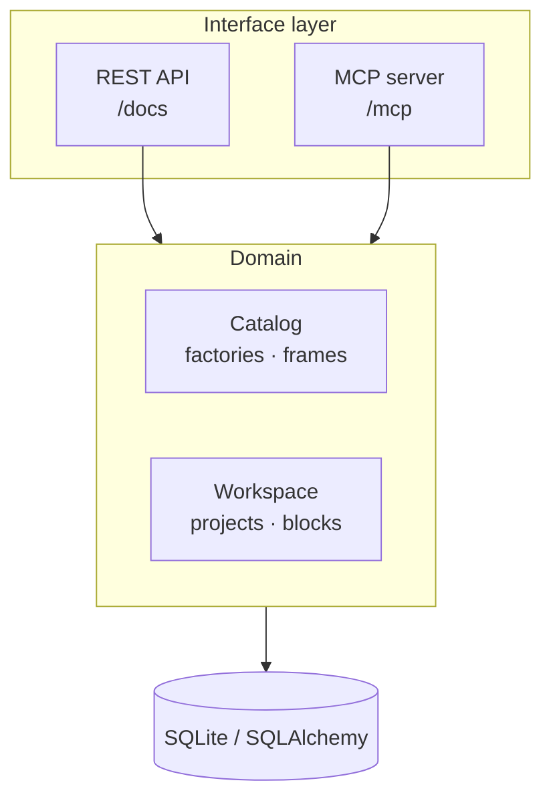

# Labinat

Labinat is a framework for building applications **declaratively**. You describe what your app is made of — tables, screens, routes, themes — and Labinat validates that description and generates the corresponding source code. It ships as a single server that exposes the whole system through a **REST API** (Swagger UI included) and a **Model Context Protocol (MCP)** endpoint, so people, scripts, and AI agents all drive it through one authenticated, permissioned surface.

## The problem

Every new project brings the same repeated decisions: how to lay out files, which commands to run, how to generate code from a data model. These decisions are rarely written down in a machine-readable way, so they get re-made on every project — and AI agents working alongside developers have no reliable contract to work from.

## How Labinat helps

- **One shared contract.** App structure is described in plain JSON. Humans, scripts, and AI agents all read and write the same format.
- **Reusable stack profiles.** A *factory* bundles everything a stack needs — code templates, build commands, component schemas — into a versioned, shareable unit.
- **Declare once, generate anywhere.** Write a *block* (a short JSON description of one component) and the factory turns it into real source files.
- **Consistent across projects.** Pin a factory version and every project using it gets the same structure, the same commands, the same output.
- **Deployable output.** Build a project, then package it into container images with one call.

## Features

| Area | What you get |
|------|--------------|
| **Declarative model** | Factories, frames, and blocks validated against JSON Schema, with custom types (maps, bindings). |
| **Code generation** | Emit source files from blocks via Jinja2 templates; run per-factory `init`/`build`/`run`/`debug` pipelines. |
| **Container packaging** | `package` builds one image per factory that ships a `Dockerfile`. |
| **REST API** | Full CRUD over catalog, workspace, and RBAC, plus live operation streaming — documented with Swagger UI at `/docs`. |
| **MCP server** | The same domain exposed as MCP tools over Streamable HTTP, so agents (Cursor, Claude Desktop, …) can drive Labinat. |
| **Auth & RBAC** | Human logins (JWT + refresh) and service-account tokens, gated by customizable roles and permissions. |
| **One process, one port** | REST and MCP are composed into a single ASGI app with one bootstrap and shared auth. |

## Architecture at a glance



- **Domain** (`app/core`, `app/base`) — the catalog holds definitions; the workspace holds instances and generated source.
- **Interface** (`app/interface`) — two thin adapters (REST + MCP) over the shared domain, using shared serializers, permissions, and identity.
- **Composition** (`app/server.py`, `main.py`) — bootstrap, compose both surfaces, serve with uvicorn, shut down cleanly.

## Quickstart

Requires **Python 3.12+**.

```bash
# 1. Install dependencies
pip install -r requirements.txt
```

The built-in defaults use production (FHS) paths like `/var/lib/labinat` — great for a server, but not writable on a dev machine. For local use, point `LABINAT_CONFIG` at a config file with project-relative paths:

```yaml
# labinat.dev.yaml — a development override, layered over the built-in defaults
catalog:   { path: "catalog" }
workspace: { path: "workspace" }
database:  { url: "sqlite:///./data/database.db" }
auth:
  token:   { secret-path: "auth/jwt-secret" }
  admins:
    lab_admin: { pass-path: "auth/lab_admin-password" }
logger:
  handlers:
    console: {}
    file: { path: "app.log" }
```

```bash
# 2. Run the server (dev)
LABINAT_CONFIG=labinat.dev.yaml python main.py
```

On first run Labinat creates the directories, generates a JWT signing secret, and writes the admin password to the configured `pass-path`. Then:

```bash
# 3. Log in with the generated admin password
curl -s -X POST http://localhost:8000/auth/login \
  -H 'Content-Type: application/json' \
  -d "{\"username\": \"lab_admin\", \"password\": \"$(cat auth/lab_admin-password)\"}"

# 4. Open the interactive API docs
open http://localhost:8000/docs
```

The MCP endpoint is served on the same port at `http://localhost:8000/mcp` (Streamable HTTP, bearer-authenticated with the same tokens).

## The two interfaces

- **REST API** — factory/frame CRUD, project/block CRUD, build/emit/package with Server-Sent-Events log streaming, and RBAC admin (users, service accounts, roles, groups). Interactive docs at `/docs`, schema at `/openapi.json`, health at `/health`.
- **MCP** — the same operations as tools, grouped into `catalog`, `projects`, and `operations`. Each tool enforces the same permissions as its REST counterpart.

See **[docs/Interfaces.md](docs/Interfaces.md)** for the full endpoint and tool reference, the auth flow, and an MCP client config example.

## Configuration

Configuration starts from built-in defaults and is optionally overridden by a YAML file named by `LABINAT_CONFIG` (deep-merged). Bind address and a few knobs also read `LABINAT_*` environment variables.

See **[docs/Configuration.md](docs/Configuration.md)** for the full reference: every setting, the environment overrides, where files live in production, and how to run in a container.

## Two roles

| Role | What they do |
|------|-------------|
| **Factory author** | Builds and maintains the stack profile — defines component types, code templates, and build/run commands. |
| **App author** | Creates projects and writes blocks — describes the app's components without touching the underlying stack. |

## Testing

```bash
pytest
```

## Documentation

- **[Concepts](docs/Concepts.md)** — technical reference for the domain model (catalog, factories, frames, blocks, pipelines, packaging, auth, bootstrap).
- **[Interfaces](docs/Interfaces.md)** — REST endpoints, MCP tools, authentication, and RBAC.
- **[Configuration](docs/Configuration.md)** — settings, environment overrides, filesystem layout, and deployment.

## Project layout

| Path | Role |
|------|------|
| `app/base/` | Foundations: `Spec`, `Schema`, `Resource`, `PipelineExecuter`, `ImageBuilder`, `Packager`, `Tokenizer`, types |
| `app/core/` | Domain: `Catalog`, `Workspace`, `Project`, `Factory`, `Frame`, `Block`, and `auth/` |
| `app/interface/` | REST (`api/`) and MCP (`mcp/`) surfaces + shared `serializers`, `permissions`, `identity` |
| `app/server.py`, `main.py` | Composition root: bootstrap, compose surfaces, serve, shut down |
| `data/` | SQLite persistence via SQLAlchemy (models + `database.py`) |
| `utils/` | Logger, shell/security/filesystem helpers |
| `catalog/` | Example on-disk factory artifacts and JSON schemas |
| `tests/` | pytest suite |

## Status

**1.0 — first stable release.** The domain model, validation, persistence, code generation, container packaging, REST API, MCP server, and RBAC auth are complete and covered by the test suite.

## License

MIT © 2026 Abdulkarim Alanazi — see [LICENSE](LICENSE).
