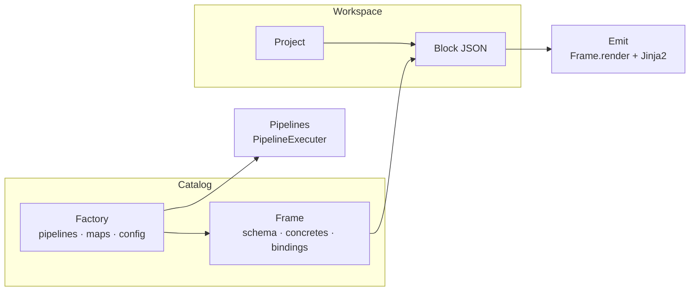

# Concepts

Technical reference for Labinat. Covers all core terms, how the system is structured, and how the pieces work together.

---

## Glossary

| Term | Definition |
|------|------------|
| **Catalog** | The registry of factories and frames. Path configured in `config.yaml` (default: `catalog/`). |
| **Factory** | A versioned stack profile: optional pipelines, frame definitions, maps, and a config schema. |
| **Frame** | A component-type definition: what fields a block may contain and what output files it produces. |
| **Block** | One instance of a frame — a validated JSON object describing a single component (e.g. one table, one screen). |
| **Concrete** | A named output file that a frame can generate. Each concrete maps to a template under `concretes/`. |
| **Bindings** | Snippet templates that describe how this frame's data appears when embedded inside another frame's output. |
| **Map** | A named key→value lookup registered as a custom schema type (`map.<name>`), typically shared across a factory. |
| **Workspace** | Where projects, blocks, and generated source live. Path configured in `config.yaml` (default: `workspace/`). |
| **Pipelines** | Optional factory shell command sequences (`init`, `build`, `run`, `debug`, `release`). Omit any a factory does not need. |
| **User** | A principal that can authenticate: a human (password + JWT) or a service account (API token only, no password). |
| **Group** | An org bucket of users bound to one Role. Users may belong to many groups. |
| **Role** | A named, customizable list of permission strings. Never hardcoded — created/edited at runtime. |
| **Permission** | A plain string (e.g. `catalog:write`) or the wildcard `*` (grants everything). |

---

## How the pieces relate



The **catalog** holds definitions; the **workspace** holds instances. A frame defines what a block may look like; a block is one concrete use of that frame inside a project.

---

## Persistence

All factory, frame, project, and block metadata is stored in a **SQLite database** (`data/database.db`, configured in `config.yaml`). The database schema is created automatically on first run.

On-disk directories under `catalog/factories/<name>/<version>/` hold files that do not live in a database column:

| On disk | Purpose |
|---------|---------|
| `base/` | Project scaffold templates (`DirectoryTemplate`) rendered by `Project.clone()` |
| `frames/<name>/module.py` | Optional Python module loaded with the frame |
| `frames/<name>/concretes/<name>.<ext>.j2` | Jinja2 output templates (or non-`.j2` static files) |
| `frames/<name>/bindings/<name>.j2` | Cross-frame snippet templates |

Runtime generated project trees live under `workspace/projects/<project_id>/` and are gitignored.

---

## Spec, Schema, and custom types

- Every resource wraps its JSON data in a [`Spec`](../base/Spec.py), which validates against a JSON Schema via [`Schema`](../base/Schema.py).
- Custom types register as `DataType` subclasses (`map.*`, `binding.*`). Schema `type` may be a single name or a list (OR semantics).
- `Spec.validate` always runs when a schema is provided — empty data still fails `required` fields.
- `Spec.decode` walks the data tree and applies registered type decoders (e.g. resolve `@block.users` bindings).

---

## Concretes

A **concrete** is one named output file a frame knows how to produce.

1. The frame's data lists concretes with `name`, `extension`, and `destination` (see `catalog/schemas/frame_schema.json`).
2. Template files live at `concretes/<name>.<extension>.j2` (or without `.j2` for static copy).
3. During emit, `Block.build` → `Frame.render` sets destinations from the concretes spec and writes rendered files under the project destination root.

---

## Bindings

**Bindings** describe cross-frame composition: how this frame's block data appears when referenced from another block (e.g. `@block.users`).

- Templates live at `bindings/<name>.j2`.
- At bind time, context keys are `src` (referenced block) and `dest` (referencing block). Top-level `self` is reserved by Jinja and must not be used.
- Decode returns a dict `{binding_name: rendered_text}` for the referenced frame's bindings.

---

## Maps

**Maps** are factory-level key/value dictionaries exposed as schema types `map.<name>`. Blocks inherit them via `Block.load` → `define_map`. Validation checks membership; decode substitutes the mapped value.

---

## Pipelines vs emit

| Concern | Driven by | Typical operations |
|---------|-----------|-------------------|
| Project toolchain | Factory `pipelines` → `PipelineExecuter` | `init`, `build`, `run`, `debug`, `release` (all optional) |
| Block → source file | Frame concretes + Jinja2 | emit via `Block.build` / `Frame.render` |

| Pipeline | Timing in `Project.build()` |
|----------|-----------------------------|
| *(scaffold)* | `clone()` — render factory `base/` into `src/<factory>/` |
| `init` | After clone, before emitting blocks (`cwd=src/<factory>`) |
| *(emit)* | Decode + render every registered block into its factory src tree |
| `build` | After emit (`cwd=src/<factory>`) |
| `run` / `debug` / `release` | On demand via `Project.run/debug/release` (same cwd) |

`Project.build()` order: **validate_config → clone → init → emit → build pipeline**.

Blocks are only registered on a project when their frame's factory is already attached (`Project.add_block`). Workspace create/load/delete block ops go through that gate; orchestration stays on `Project` (e.g. `workspace.get_project(...)` then `project.build()`).

---

## Factory packages

Factories are portable `.tar.gz` archives. [`Packager`](../base/Packager.py) handles stage/manifest/pack/unpack; [`Catalog`](../core/Catalog.py) owns `export_factory` / `import_factory`.

**Specs live in the database.** On-disk catalog trees hold artifacts only (`module.py`, concretes, bindings, `base/`). Spec JSON (`factory.json` / `frame.json`) exists only inside packages for transport:

- **Export** — Specs from DB + artifacts from disk → archive (JSON written into the package only).
- **Import** — Specs from package JSON → DB; artifacts → disk (Spec JSON stripped from the catalog tree).

**Archive layout**

```
MANIFEST.json                 # format_version, name, version, checksums
factory/<name>/<version>/
  factory.json                # factory Spec (transport only)
  frames/<frame>/
    frame.json                # frame Spec (transport only)
    module.py
    concretes/*
    bindings/*
  base/                       # optional clone scaffold
```

| Layer | Role |
|-------|------|
| `utils/fs` | Shared filesystem helpers |
| `Packager` | stage, MANIFEST, pack, unpack |
| `Catalog` | `export_factory` / `import_factory` (DB Specs + disk artifacts) |
| `Factory` | Single factory instance hydrated from DB |

Share factories via export/import. Path traversal and unsupported `format_version` are rejected.

---

## Authentication and authorization

Auth classes live in [`core/auth/`](../core/auth) and own their own persistence — `User.get(...)`, `user.set_password(...)`, `user.login(...)` each read and write the database directly. Generic mechanisms sit underneath them: [`Tokenizer`](../base/Tokenizer.py) signs JWTs and mints opaque secrets, [`utils/security`](../utils/security.py) hashes passwords, the same way `Packager` pairs with `utils/fs`.

| Class | Role |
|-------|------|
| `User` | Accounts, passwords, login, membership, effective permissions |
| `Group` | A bucket of users bound to one role |
| `Role` | A named permission list (`grant` / `revoke` / `has_permission`) |
| `Session` | An issued login: JWT access token + rotatable refresh token |
| `ServiceToken` | A service account's long-lived API token |

**Users vs. service accounts** — one `users` table, split by `is_service`:

| | Human user | Service account |
|---|---|---|
| Authenticates with | Password → `Session` (JWT + refresh token) | A `ServiceToken` secret |
| `password_hash` | set | always `None` |
| Typical caller | a person logging into a UI | external software calling the API |

- **Login** — `user.login(password)` (or `User.authenticate(username, password)`) verifies the Argon2 hash and returns a `Session`. `Session.refresh(token)` rotates: the old refresh token is revoked and a new pair issued, so a captured token is single-use. `Session.revoke` / `Session.revoke_all` log out.
- **Service accounts** — `user.issue_token(name)` mints a `ServiceToken`, refusing human users. The raw secret is readable once, from `token.secret`; only its SHA-256 hash is stored, so a lost token is replaced rather than recovered.
- Both paths reject deactivated accounts, so `user.deactivate()` immediately kills sessions and tokens alike.

**Roles and groups** (`User` → `UserGroup` → `Group` → `Role` → `permissions[]`) are runtime data, never hardcoded:

- A role is a name plus a list of permission strings; `Role.WILDCARD` (`*`) grants everything.
- A group binds to one role; a user joins any number of groups.
- **Conflict resolution is a union** — `user.permissions` is the union of every role reachable through the user's groups. More membership only ever adds rights; there is no deny list or role ranking. `user.require_permission(...)` raises `PermissionDeniedError`.

First-run setup is not an auth concern — see [Bootstrap](#bootstrap) below.

---

## Bootstrap

[`app/bootstrap.py`](../app/bootstrap.py) is a library of small setup operations; [`app/server.start()`](../app/server.py) calls them in sequence to bring the process up:

```python
def start() -> dict:
    bootstrap.load()                              # config.yaml → bootstrap.config

    token_secret = bootstrap.create_token_secret()  # resolve/generate the JWT secret
    bootstrap.init(token_secret)                    # logger, database, controller, Session signing
    bootstrap.create_admin()                        # admin role, Admins group, admin user(s)

    return bootstrap.config
```

`create_token_secret()` runs before `init()` because it only touches the filesystem (no database yet); `create_admin()` runs after `init()` because it needs the database to be up. Nothing in `bootstrap.py` runs on import — each function does one job and is safe to repeat, since `start()` runs on every process start: fill in what is absent, leave existing records alone. That way a restart never overwrites an admin's later changes (a rotated password, an edited role).

`bootstrap.create_token_secret` and `bootstrap.create_admin` read the `auth` section of `config.yaml`:

```yaml
auth:
  token:
    secret-path: "auth/jwt-secret"   # generated on first run
    algorithm: "HS256"
    access_ttl_minutes: 15
    refresh_ttl_days: 30
  admin:
    lab_admin:
      pass-path: "auth/lab_admin-password"
```

- **Signing secret** (`create_token_secret`) — the HMAC key that signs access tokens. Read from `secret-path`, generated there on first run (mode `600`) and left untouched afterwards. It is persisted rather than regenerated per boot because a new secret invalidates every token signed with the old one, logging everybody out; delete the file to rotate deliberately. `create_token_secret` raises `BootstrapError` if `secret-path` is missing. The resolved value is passed into `bootstrap.init`, which forwards it to `Session.init`; neither `Session` nor `Tokenizer` touch the filesystem themselves.
- **Admin role and group** (`create_admin`) — the `admin` role (`["*"]`) and the `Admins` group bound to it, seeded once and left alone afterwards.
- **Admin users** (`create_admin`) — one per key under `auth.admin` (the key *is* the username). Each new admin joins `Admins`, so it inherits full access, with a random password written to its `pass-path`. Existing usernames are skipped untouched.

Generated secrets are gitignored (`auth/*-password`, `auth/*-secret`).

---

## Logging

All application logging goes through [`utils/logger.py`](../utils/logger.py), configured from the `logger` section of `config.yaml` during `bootstrap.init()`.

| Severity | Typical use |
|----------|-------------|
| `debug` | Internals: construct/load/validate/decode, type registration, template I/O, soft lookups that return `None` in-memory |
| `info` | Lifecycle boundaries: create/update/delete factory/frame/project/block, pipeline start/end, clone, build, render |
| `warning` | Soft failures before return/`raise`: missing catalog/workspace entity, validation failure about to propagate |
| `error` | Hard failures: pipeline non-zero exit, decode failure, concrete destination unset, shell command failure |
| `critical` | Reserved for unrecoverable process-level failures |

### Layer conventions

| Layer | Prefer | Avoid |
|-------|--------|-------|
| **`base/`** | `debug` for Spec/Schema/Resource/Template internals; `warning`/`error` only on validate/decode/pipeline failure | Spamming `info` on every validate/render leaf |
| **`core/`** | `info` for Catalog/Workspace CRUD and emit/build; `debug` for Frame/Factory/Block construct and in-memory getters | Treating a missing `get_*` that returns `None` as `error` |
| **`utils/`** | `debug` for shell stdout lines; `error` for failed shell commands | |

Hot paths (e.g. `BindingType.validate` during jsonschema checks) stay quiet — log at registration or decode time instead.

Set `logger.level: DEBUG` in `config.yaml` (or the console handler level) to see base/core construct and validate traces.

---

## Repository layout

| Path | Role |
|------|------|
| `catalog/` | Factory on-disk layout: frames, concretes, bindings, maps data, base |
| `catalog/schemas/` | JSON schemas that validate factory and frame data |
| `workspace/` | Projects with generated `src/` |
| `core/` | Domain models: `Catalog`, `Workspace`, `Project`, `Factory`, `Frame`, `Block` |
| `core/auth/` | `User`, `Group`, `Role`, `Session`, `ServiceToken` |
| `base/` | Foundations: `Resource`, `CatalogResource`, `Spec`, `Schema`, `PipelineExecuter`, `DataType`, `Binding`, `Packager`, `Tokenizer` |
| `data/` | SQLite persistence via SQLAlchemy (models + `database.py`) |
| `utils/` | `RuntimeModule`, centralized logger, shell and security helpers |
| `tests/` | pytest suite |
| `app/` | Composition root: wires config into a running process |
| `app/server.py` | `start()`: sequences `bootstrap`'s setup operations |
| `app/controller.py` | Singleton `Catalog` and `Workspace` |
| `app/bootstrap.py` | Idempotent setup operations: config loading, logger/database/controller, auth signing secret, admin role/group/users |
| `config.yaml` | Catalog/workspace paths, database URL, auth token + admin settings, logger settings |

---

## Resource identifiers

| Resource | Format | Example |
|----------|--------|---------|
| Factory | `name:version` | `backend-fastapi:v1` |
| Frame | `factory:version.frame` | `backend-fastapi:v1.table` |
| Block | `frame_id.block_name` | `backend-fastapi:v1.table.users` |

---

## Running

Requires Python 3.12+ (see project env). Configure `config.yaml`, then:

```bash
python main.py
```

`server.start()` loads the config, sets up the logger (format, datefmt, console/file handlers), auto-creates the database schema, wires the `Catalog` and `Workspace` singletons, and prepares auth (token signing secret, admin role/group/users) — see [Bootstrap](#bootstrap).

Run the test suite:

```bash
pytest
```
