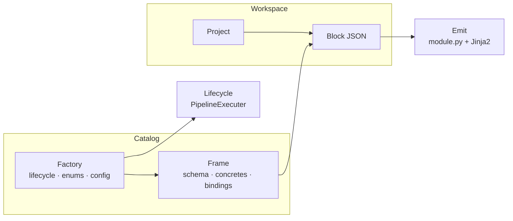

# Concepts

Technical reference for Labinat. Covers all core terms, how the system is structured, and how the pieces work together.

---

## Glossary

| Term | Definition |
|------|------------|
| **Catalog** | The registry of factories and frames. Path configured in `config.yaml` (default: `catalog/`). |
| **Factory** | A versioned stack profile: lifecycle commands, frame definitions, maps, and a config schema. |
| **Frame** | A component-type definition: what fields a block may contain and what output files it produces. |
| **Block** | One instance of a frame — a validated JSON object describing a single component (e.g. one table, one screen). |
| **Concrete** | A named output file that a frame can generate. Each concrete name maps to a Jinja2 template. |
| **Bindings** | Snippet templates that describe how this frame's data appears when embedded inside another frame's output. |
| **Workspace** | Where projects, blocks, and generated source live. Path configured in `config.yaml` (default: `workspace/`). |
| **Lifecycle** | The factory's set of shell command sequences (build, rebuild, run, debug, release) for operating the project toolchain. |

---

## How the pieces relate



The **catalog** holds definitions; the **workspace** holds instances. A frame defines what a block may look like; a block is one concrete use of that frame inside a project.

---

## Persistence

All factory, frame, project, and block data is stored in a **SQLite database** (`data/database.db`, configured in `config.yaml`). The database is created automatically on first run.

On-disk directories under `catalog/` hold only files that cannot live in a database column:

| On disk | Purpose |
|---------|---------|
| `frames/<name>/module.py` | Python module called during code generation |
| `frames/<name>/concretes/<name>.j2` | Jinja2 output templates |
| `frames/<name>/bindings/<type>.j2` | Cross-frame snippet templates |

---

## Concretes

A **concrete** is one named output file a frame knows how to produce.

1. The frame's data lists concrete names, e.g. `"concretes": ["model", "router"]`.
2. For each name there is a Jinja2 template at `concretes/<name>.j2`.
3. During emit, `module.loader(block_data, concrete_name)` returns the render context; the template is rendered into a source file.

One frame can declare multiple concretes — each is an independent output tied to the same block data.

---

## Bindings

**Bindings** describe cross-frame composition: how this frame's block data appears when it is referenced inside another frame's generated output — for example as an import statement, a variable, or an inline expression. Templates live at `bindings/<type>.j2`.

---

## Lifecycle vs emit

| Concern | Driven by | Typical operations |
|---------|-----------|-------------------|
| Project toolchain | Factory lifecycle → `PipelineExecuter` | build, rebuild, run, debug, release |
| Block → source file | Frame `module.py` + `concretes/*.j2` | emit, render |

Lifecycle commands are shell sequences defined in the factory's data and executed by `PipelineExecuter`. Per-block emit (calling `module.loader` and rendering templates) is under active development.

---

## Repository layout

| Path | Role |
|------|------|
| `catalog/` | Factory on-disk layout: frames, concretes, bindings, enums, base |
| `catalog/schemas/` | JSON schemas that validate factory and frame data |
| `workspace/` | Projects with generated `src/` |
| `core/` | Domain models: `Catalog`, `Workspace`, `Project`, `Factory`, `Frame`, `Block` |
| `base/` | Foundations: `Resource`, `CatalogResource`, `Spec`, `Schema`, `PipelineExecuter`, `DataType` |
| `data/` | SQLite persistence via SQLAlchemy (models + `database.py`) |
| `utils/` | `RuntimeModule` (dynamic import), logger, shell helpers |
| `server.py` | Bootstrap: config → logger → database → catalog + workspace |
| `controller.py` | Singleton `Catalog` and `Workspace` |
| `config.yaml` | Catalog path, workspace path, database URL, logger settings |

---

## Resource identifiers

| Resource | Format | Example |
|----------|--------|---------|
| Factory | `name:version` | `backend-fastapi:v1` |
| Frame | `factory:version.frame` | `backend-fastapi:v1.table` |
| Block | `frame_id.block_name` | `backend-fastapi:v1.table.users` |

---

## Running

Requires Python 3. Configure `config.yaml`, then:

```bash
python main.py
```

`server.init()` loads the config, sets up the logger, auto-creates the database schema, and wires the `Catalog` and `Workspace` singletons.
